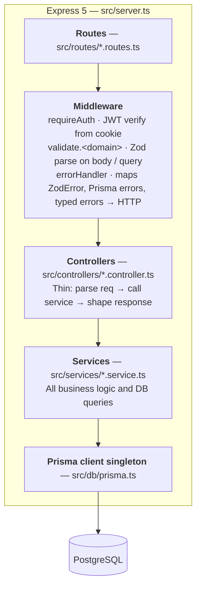
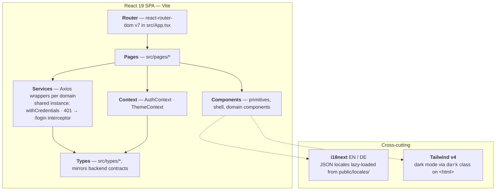
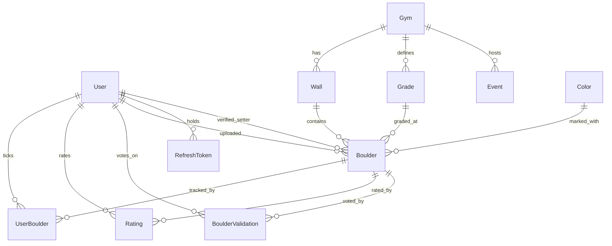
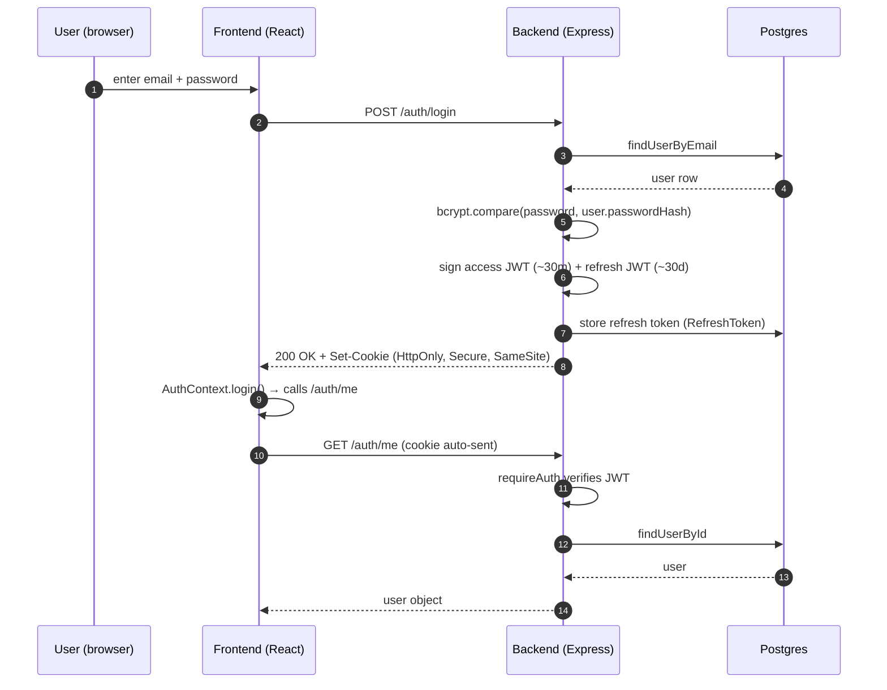

# Beta Tracker — Architecture

## At a glance

A two-tier monorepo. A React 19 SPA (Vite) talks to a stateless Express 5 API over HTTPS, sending HTTP-only cookies for auth. The API persists everything in Postgres via Prisma. Both apps share strict-TypeScript discipline (no `any`, no `!`, no `@ts-ignore`). State lives in Postgres; the frontend keeps only auth and theme in React Context. Every workflow (validation voting, rating consensus, XP awards) runs synchronously inside the request that triggered it.

---

## Backend layering

Routes → middleware → controllers → services → Prisma. Each layer has one reason to change. Controllers stay thin so the same service can be reused if a non-HTTP entry point ever appears (a CLI seeder, a scheduled job). Path alias `#/` → `src/`.

---

## Frontend layering

Pages call services. Cross-cutting client state lives in two Context providers — auth and theme. There's no global store: Postgres is the source of truth, so the frontend doesn't need one. Path alias `@/` → `src/`.

---

## Data model

The spine is **User → Gym → Wall → Boulder**. Around each boulder sit three community interactions: ticks (`UserBoulder`), ratings (`Rating`), and validation votes (`BoulderValidation`). Setters are either registered users (`verifiedSetterId`) or free-text names. Grades are per-gym — one gym's "V3" is not another's.

Full schema in [`backend/prisma/schema.prisma`](../backend/prisma/schema.prisma).

---

## Auth flow

JWT-based: a short access token (~30m) and a longer refresh token (~30d), both stored as HTTP-only, Secure, SameSite cookies. Refresh tokens are stored server-side so they're revocable on logout. The Axios interceptor catches 401s and redirects to `/login`.

HTTP-only cookies can't be read by JavaScript, which closes the XSS-driven token-theft vector you get with `localStorage`. The CSRF trade-off is mitigated by `SameSite` and an explicit CORS allow-list.

---

## Tech stack

| Concern         | Choice                                                |
| --------------- | ----------------------------------------------------- |
| Package manager | pnpm workspaces                                       |
| Backend         | Node 22+ · Express 5 · Prisma 6 · PostgreSQL 16       |
| Validation      | Zod 4                                                 |
| Auth            | JWT (jsonwebtoken) + bcryptjs + HTTP-only cookies     |
| Frontend        | React 19 · Vite 7 · Tailwind v4 · react-router-dom 7  |
| HTTP            | Axios                                                 |
| i18n            | i18next (EN / DE)                                     |
| Image upload    | Multer (local disk)                                   |
