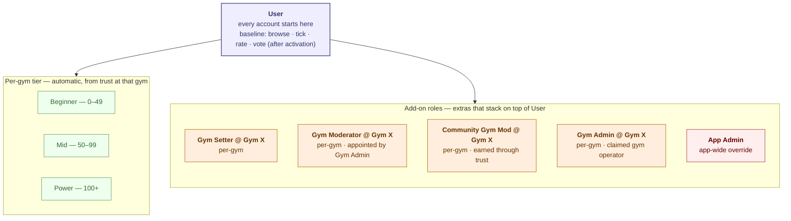
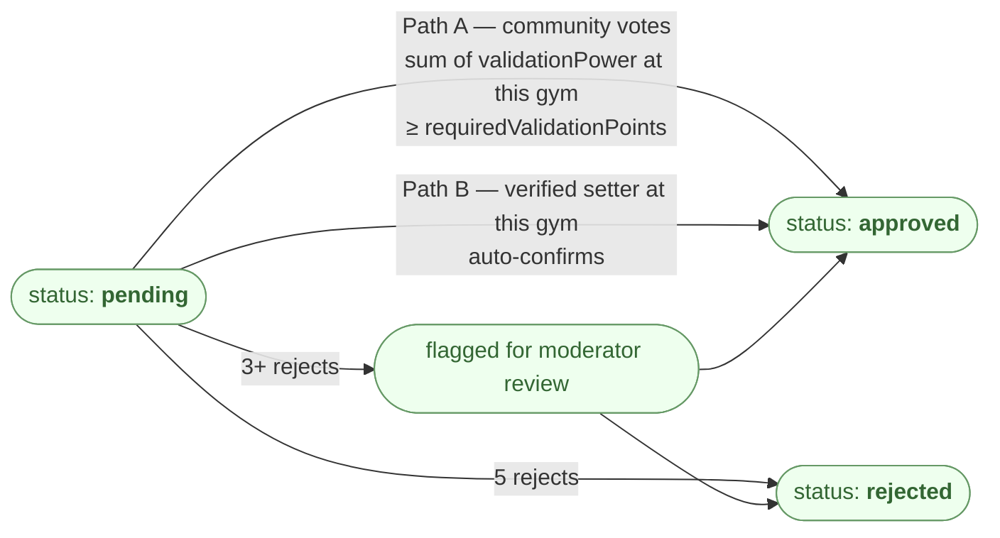
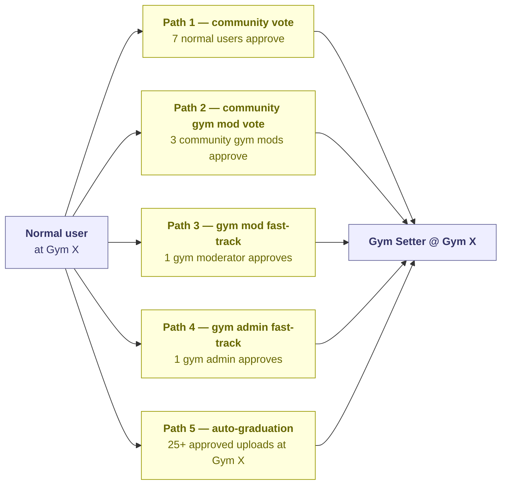
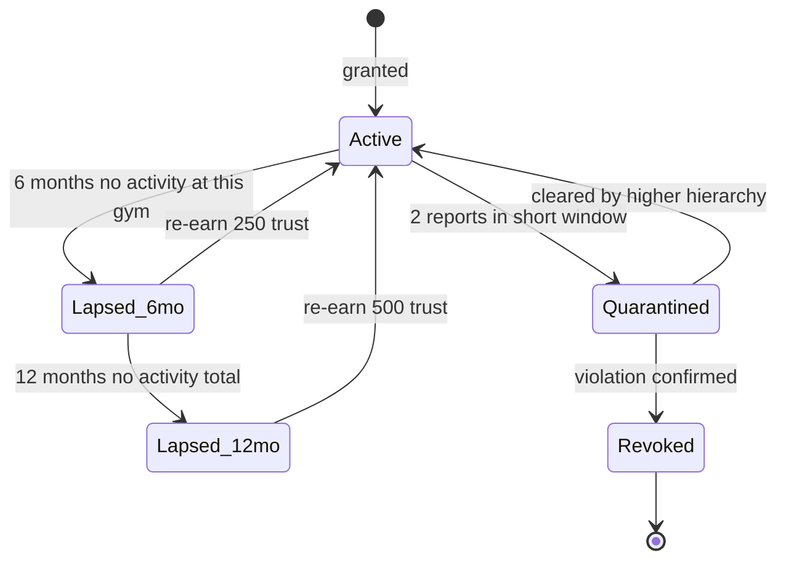
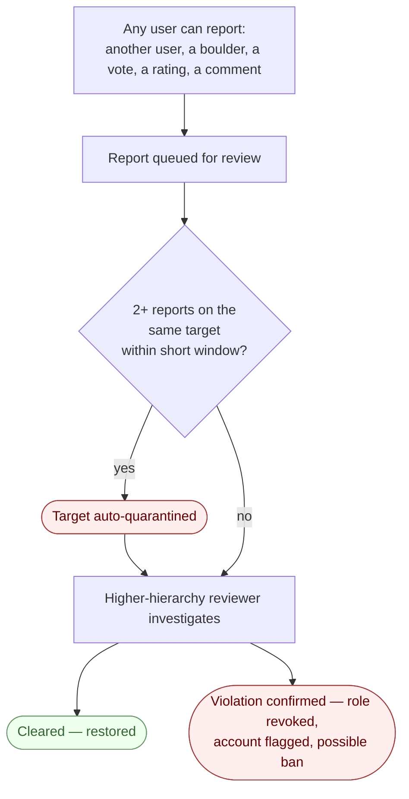

# Beta Tracker — Validation, Trust & Roles

Who can do what, how rights are earned, how content gets approved, how people get promoted, how inactive roles lapse, and how bad behaviour is handled. The most design-dense part of the project, and the area I find most interesting to build.

---

## 1. Actor model

- **User** — the baseline. Every account is a User. Browse, tick boulders for a personal logbook, rate, and (after activation) vote on validations. Everything below is an extra layered on top.
- **App Admin** — me. Single user, can override anything app-wide. (As a fast action to prevent trolling or abusing and confirm the Gym Admins )
- **Gym Admin** — the gym operator who has claimed their listing. Optional: many gyms run fully community-maintained.
- **Gym Moderator** — appointed by Gym Admin; the gym vouches for them.
- **Community Gym Moderator** — earned through trust at that specific gym.
- **Gym Setter** — per-gym setter rights. Multiple promotion paths.
- **Per-gym tier (Beginner / Mid / Power)** — every User automatically has a tier at every gym they have trust at, derived from that trust (0–49 / 50–99 / 100+). The same person can be Power at one gym and Beginner at another. Tier is not a role — it's a derived facet of being a User.

### Two core principles

1. **Per-gym scoping.** Trust, roles, and most rights are scoped to a specific gym. A Power user at Gym A is not automatically anything at Gym B.
2. **Two parallel promotion paths.** *Gym-driven* (appointed by Gym Admin/Mod, when the gym is claimed) and *community-driven* (earned through trust + community votes, always available — just slower).

---

## 2. Trust vs. XP

| | Trust points | Experience points (XP) |
|---|---|---|
| Scope | Per-gym | App-wide |
| What it does | Grants rights — voting weight, promotion eligibility, role progression | Vanity / progression display |
| Earned from | Approved upload, aligned vote, rating on approved boulder *(all per-gym)* | Tick, rate, validate-vote, upload-approved |
| Decay | Inactivity discount (see §6) | None |

XP exists for the gamification feel. Trust is the actual political currency of the app.

---

## 3. Boulder validation

How a boulder transitions from `pending` to `approved`. Two paths.

### Vote weight

Email verification is the activation gate. After verification, vote weight derives from the voter's trust at the gym where the boulder lives:

| State | validationPower |
|---|---|
| Registered, email **not** verified | 0 (inert) |
| Activated, 0–49 trust at this gym | 1 |
| Activated, 50–99 trust at this gym | 2 |
| Activated, 100+ trust at this gym | 3 |

Each vote stores the voter's `validationPower` at vote time, so retroactive trust changes don't rewrite past sums.

### Required validation points

Set at upload time from uploader's trust at the same gym:

| Uploader trust at this gym | requiredValidationPoints |
|---|---|
| 0–49 | 3 |
| 50–99 | 2 |
| 100+ | 1 |

If the uploader is a Gym Setter at this gym → instant approval.

### What this delivers

- A fresh user uploads → 3 newbie votes (1+1+1) reaches threshold.
- A Power user uploads at their home gym → 1 newbie vote approves it.
- A user with no trust at Gym X uploads at Gym X → treated as fresh user there, regardless of trust elsewhere.

---

## 4. Promotion to Gym Setter

Five paths. Pick whichever clears first.

Same approver-rank-tiered pattern as boulder validation: higher-rank approvers, fewer needed.

---

## 5. Promotion to Community Gym Moderator

Trust-only path. The threshold *decreases* the more gyms you've already moderated as a Community Gym Mod — rewarding cross-gym track record while still requiring local skin in the game.

| Promotion to N-th CGM role | Trust required at the new gym |
|---|---|
| 1st (no prior CGM roles) | 1500 |
| 2nd | 1250 |
| 3rd | 1000 |
| 4th+ | 750 (floor) |

`threshold = max(750, 1500 − 250 × prior_CGM_count)`. Trust still has to be earned natively at the new gym — cross-gym trust does not transfer directly.

---

## 6. Inactivity, lapse and re-earn

Roles aren't permanent. They lapse if the holder stops contributing.

- 6 months no activity at the gym → role enters `lapsed_6mo`. Restore: 250 fresh trust at that gym.
- 12 months no activity → `lapsed_12mo`. Restore: 500 fresh trust.
- "Activity" = any tick / vote / rating / upload at that gym while holding the role.
- Lapsed roles keep their history (grant date, reasons). They just lose active rights until re-earned.

---

## 7. Reports & quarantine

Bad-actor handling without admin micromanagement.

- Anyone can report any user, boulder, vote, rating, or comment.
- 2 reports against the same target within ~72 hours → automatic quarantine pending review.
- Quarantine effect: voting power and promotion paths suspended at all gyms. Browsing and ticking own boulders still allowed. Resolves only when a higher-hierarchy reviewer rules.
- "Higher hierarchy" = whoever outranks the reported user in the gym where the alleged violation happened. App Admin always qualifies.
- Quarantine cap ~14 days — protects against reports going un-investigated forever.
